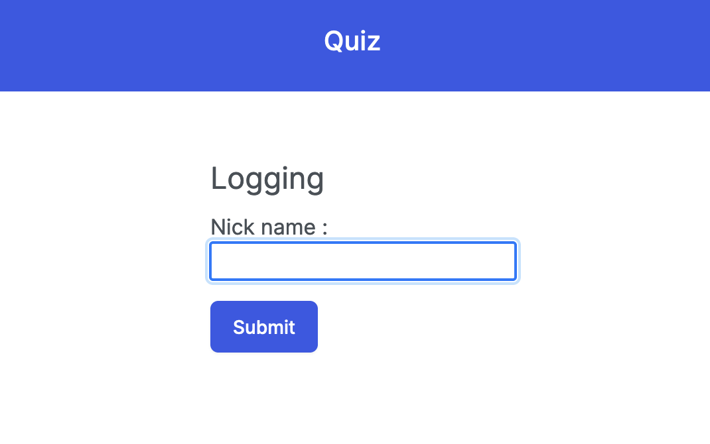
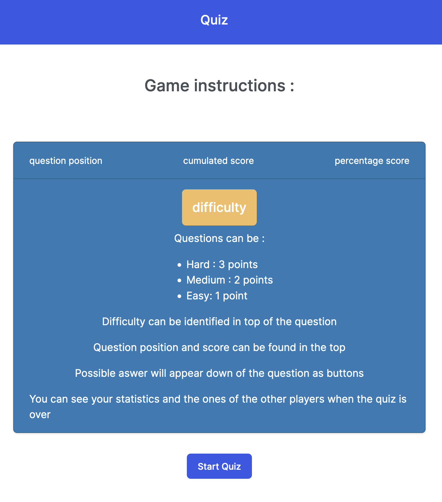
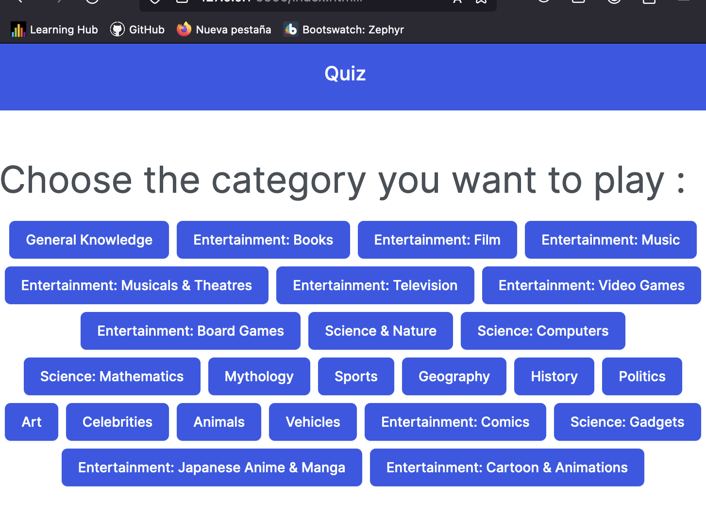
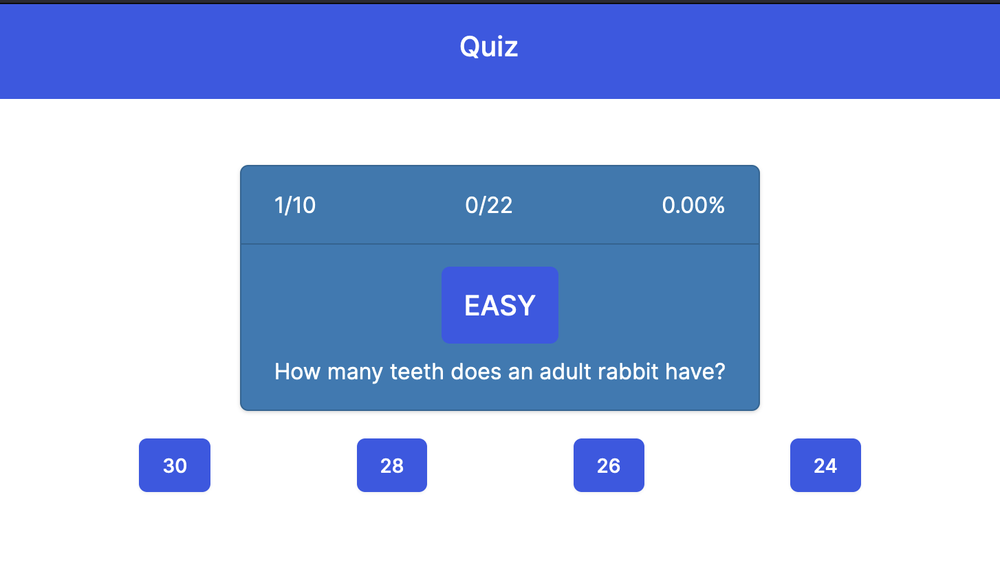
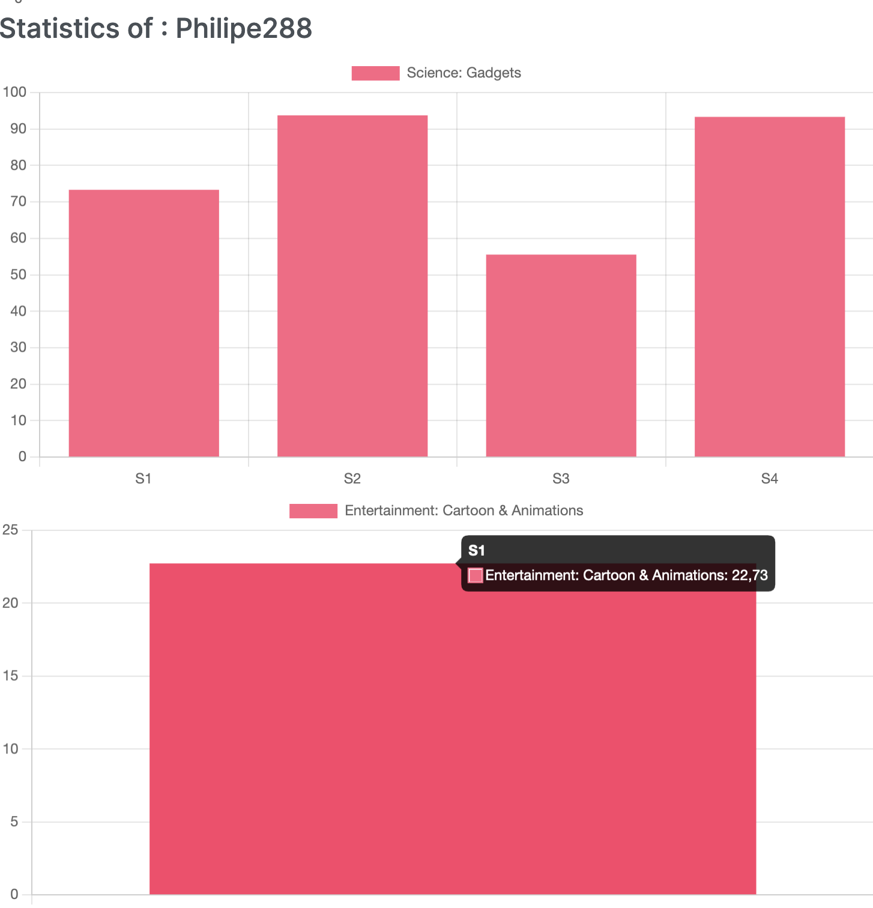

---
# JavaScript Quiz Project

## Description
This project is a JavaScript quiz application where users can answer questions from various categories. It utilizes HTML, CSS, and JavaScript to create a dynamic and interactive quiz experience.

## Features
- Logging in with a nickname.
- Game istructions and start button
- Choosing a quiz category.
- Displaying quiz questions with multiple-choice answers.
- Providing feedback on user answers.
- Keeping track of the user's score.
- Displaying the final quiz score.
- Storing user scores in local storage.
- Visualizing user statistics using Chart.js.

## Usage
1. Clone or download the project repository.
2. Open the `index.html` file in a web browser.
3. Enter a nickname to start the quiz.
4. Choose a category to play.
5. Answer the quiz questions by selecting one of the multiple-choice options.
6. Receive feedback on each answer.
7. Continue answering questions until the quiz is complete.
8. View your final score and play again if desired.

## Technologies Used
- HTML
- CSS (Bootstrap for styling)
- JavaScript
- Axios (for making HTTP requests)
- Chart.js (for displaying graphics)

## Project Structure
- `index.html`: Main HTML file containing the quiz interface.
- `styles/`: Directory containing CSS files for styling.
- `scripts/`: Directory containing JavaScript files for functionality.

## Preview

